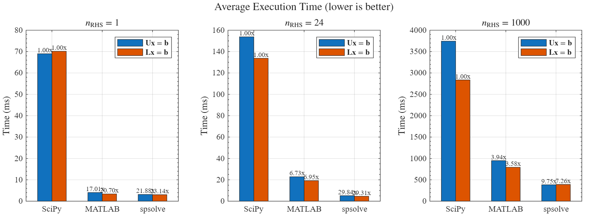

# spsolve

`spsolve` is a sparse linear equations solver that is compatible with `scipy.sparse.linalg.spsolve_triangular`.

It implements a naïve forward / backward substitution solver which:

1. Use AVX2 instructions to vectorize the calculation.
2. Use OpenMP to parallel when $\mathbf{b}$ has many columns. Achieve the best performance when $n_\text{RHS} \ge 4 \times n_\text{cores}$

## Usage

```bash
pip install -U git+https://github.com/capric98/spsolve
```

And then replace `scipy.sparse.linalg.solve_triangular` to `spsolve.solve_triangular` in your code.

## Limitations

1. Currently only support CPUs with AVX2 instructions.

2. Only support `scipy.sparse.csr_matrix` sparse matrix.

3. Slight performance degradation when $n_\text{RHS}$  is not fourfold.

4. Not fully parallel when $n_\text{RHS}$ is small.

5. Limited data type supported:

   |       |  $\mathbf{A}$   |  \   |   $\mathbf{b}$    |  =   |   $\mathbf{x}$    |                                                              |
   | ----: | :-------------: | :--: | :---------------: | :--: | :---------------: | :----------------------------------------------------------- |
   | dtype |  `np.float64`   |      |   `np.float64`    |      |   `np.float64`    | ✅                                                            |
   | dtype |  `np.float64`   |      | ``np.complex128`` |      | ``np.complex128`` | ✅ View `b` as double and solve a $2\times n_\text{RHS}$ problem. |
   | dtype | `np.complex128` |      |   `np.float64`    |      | ``np.complex128`` | ❌ Will support later.                                        |
   | dtype | `np.complex128` |      |  `np.complex128`  |      |  `np.complex128`  | ❌ Will support later.                                        |

   All other data types will be cast to `np.float64` or `np.complex128`. For experts who benefit from low precision or require higher precision, it should be easy to modify this project.

6. The project uses LP64 Interface, if you have very big matrices with indices exceed `int32`, maybe you should consider something else like [SLEPc](https://slepc.upv.es/), [Trilinos](https://github.com/trilinos/Trilinos), etc.

## Performance
* Environment:
  * Intel Core i5-13600K, P-Cores@5.2GHz, Windows 10 LTSC
  * Python 3.13.5: `OMP_NUM_THREADS=6`, manually bind to physical P-Cores, `overwrite_b=True`
  * MATLAB R2025a: `maxNumCompThreads=6` (default)

* Comparison between SciPy, MATLAB and spsolve:

  * $\mathbf{A}$: $10000\times10000$ sparse matrix with density of $10\%$, non-zero main diagonal dominant

  * $\mathbf{b}$: $10000\times n_\text{RHS}$ dense matrix

  * Each function runs 1000 times and uses the averaged time of single solve.



## TODO

- [ ] Implement `spsolve_triangular` for `np.complex128`.
- [ ] Implement `solve` for general `scipy.sparse` matrices.

## Acknowledgments

* [MATLAB: mldivide, \\](https://www.mathworks.com/help/matlab/ref/double.mldivide.html)
* [NumPy](https://numpy.org/)
* [OpenMP](https://www.openmp.org/)
* [SciPy](https://scipy.org/)
* [nanobind](https://github.com/wjakob/nanobind)
* [psutil](https://github.com/giampaolo/psutil)
