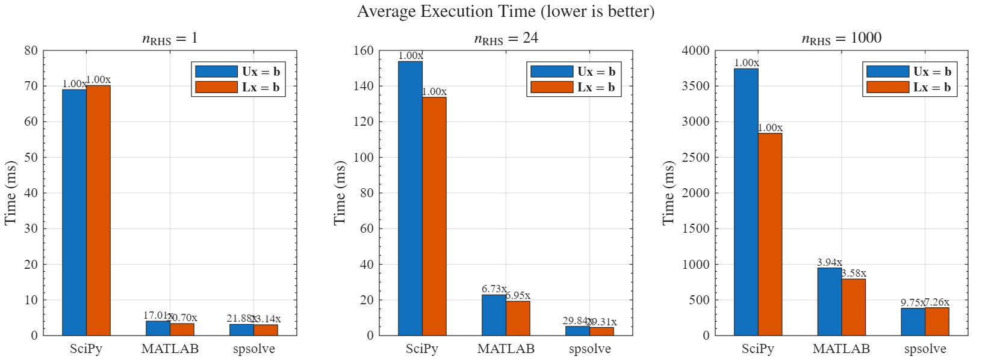

# spsolve

`spsolve` is a sparse linear equations solver that is compatible with `scipy.sparse.linalg.spsolve_triangular`.

It implements a naïve forward / backward substitution solver which:

1. Use AVX2 instructions to vectorize the calculation.
2. Use OpenMP to parallel when $\mathbf{b}$ has many columns. Achieve the best performance when $n_\text{RHS} \ge 4 \times n_\text{cores}$

## Usage

```bash
pip install -U git+https://github.com/capric98/spsolve
```

And then replace `scipy.sparse.linalg.solve_triangular()` to `spsolve.solve_triangular()` in your code.

A `spsolve.spsolve()` function is available for replacement of `scipy.sparse.linalg.solve()`, no speedup is expected because it currently uses a single-threaded `scipy.sparse.linalg.splu` and then solve `Ax=b` via `x = Pc @ { U \ [ L \ (Pr@b) ] }`. Try [PyPardiso](https://github.com/haasad/PyPardiso), [PETSc](https://petsc.org/), [SuiteSparse](https://github.com/DrTimothyAldenDavis/SuiteSparse), etc. for general using cases, or try the experimental Intel MKL PARDISO based `spsolve()` if user has Intel MKL installed before hand, and build this project with explicitly flag set:

```
pip install -U git+https://github.com/capric98/spsolve --config-setting=cmake.args="-DSP_USE_MKL=ON"
```

## Limitations

1. For CPUs without AVX2 instructions, it will fallback to a non-vectorized implementation.

2. Native support only for `scipy.sparse.csr_array`, other sparse array will be converted to CSR format.

3. Slight performance degradation when $n_\text{RHS}$  is not fourfold.

4. Not fully parallel when $n_\text{RHS}$ is small.

5. Limited data type supported, lack of motivation to support `np.complex128` currently:

   |       |       $A$       |  \   |        $b$        |  =   |        $x$        |                                                              |
   | ----: | :-------------: | :--: | :---------------: | :--: | :---------------: | :----------------------------------------------------------- |
   | dtype |  `np.float64`   |      |   `np.float64`    |      |   `np.float64`    | ✅                                                            |
   | dtype |  `np.float64`   |      | ``np.complex128`` |      | ``np.complex128`` | ✅ View `b` as double and solve a $2\times n_\text{RHS}$ problem. |
   | dtype | `np.complex128` |      |   `np.float64`    |      | ``np.complex128`` | ❌                                                            |
   | dtype | `np.complex128` |      |  `np.complex128`  |      |  `np.complex128`  | ❌                                                            |

   All other data types will be cast to `np.float64` or `np.complex128`. For experts who benefit from low precision or require higher precision, it should be easy to modify this project.

6. For experimental PARDISO solver, it can actually reuse the factorized result of the sparse matrix, however I did not implement the logic

## Performance
* Environment:
  * Intel Core i5-13600K, P-Cores @5.2GHz, Windows 10 LTSC
  * Python 3.13.5: `OMP_NUM_THREADS=6`, manually bind to physical P-Cores, `overwrite_b=True`
  * MATLAB R2025a: `maxNumCompThreads=6` (default)

* Comparison between SciPy, MATLAB and spsolve:

  * $\mathbf{A}$: $10000\times10000$ sparse array with density of 10%, non-zero main diagonal dominant, then use `scipy.sparse.(tril|triu)` to get a triangular sparse array, stored in CSR format

  * $\mathbf{b}$: $10000\times n_\text{RHS}$ dense `np.ndarray`

  * Each function runs 1000 times and uses the averaged time of single solve.



## TODO

- [ ] Implement `spsolve_triangular` for `np.complex128`.
- [ ] Implement `solve` for general `scipy.sparse` matrices. **Difficulties:**
  * For a general case of $\mathbf{A}\mathbf{x}=\mathbf{b}$, it usually requires a factorization of A so that it can be solved by utilizing triangular solver multiple times, for a symmetric or Hermitian matrix it may be factorized by $\mathbf{A}=\mathbf{L}\mathbf{L}^*$ (Cholesky decomposition) and for general matrix it can be $\mathbf{A}=\mathbf{L}\mathbf{U}$ (LU decomposition). However the direct decomposition will introduce fill-in and sometimes it's catastrophic, making the decomposed matrix almost dense.
  * To reduce fill-in, we need algorithm to generate an optimized permutation so that the decomposition of $\mathbf{P}(\mathbf{A}\mathbf{Q})$, where $\mathbf{Q}$ is a permutation and $\mathbf{P}$ is a pivoting for numerical stability (I guess). This kind of algorithm is complicated, for example, COLAMD from [SuiteSparse](https://github.com/DrTimothyAldenDavis/SuiteSparse) or Nested Dissection. I did not find a out-of-the-box solution to do the factorization (though COLAMD is BSD licensed, UMFPACK from SuiteSparse is LGPL licensed which is incompatible with BSD), which means it still requires some coding to make it works.
  * Another thing is, AFAIK, COLAMD is fast but single-threaded, while nested dissection can be parallelized. Since this project is aiming to be a light-weight, out-of-the-box solution for a single machine, I have no idea which is better for this using case.
  * Overall, I guess I would not implement this in a very long time :(

## Acknowledgments

* [MATLAB: mldivide, \\](https://www.mathworks.com/help/matlab/ref/double.mldivide.html)
* [NumPy](https://numpy.org/)
* [OpenMP](https://www.openmp.org/)
* [SciPy](https://scipy.org/)
* [nanobind](https://github.com/wjakob/nanobind)
* [psutil](https://github.com/giampaolo/psutil)
